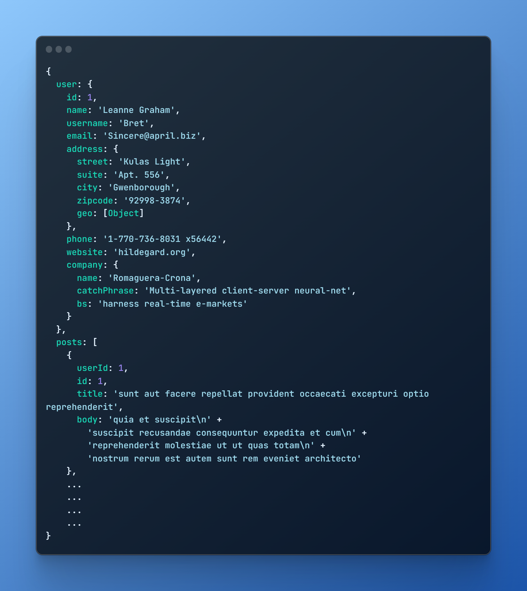

# Bu proje Kodluyoruz [Intermediate Front-End Web Development Patikası](https://academy.patika.dev/paths/orta-seviye-frontend-web-development-patikasi) **"React"** Dersinin 1. Ödevidir

- Bu fonksiyon **"async"** olarak tanımlanmalı ve default olarak dışa aktarılmalıdır. Fonksiyonun içindeki asenkron fonksiyonlar **"await"** ile tanımlanmalıdır.

- Fonksiyon **Number** tipinde tek parametre alır. Bu parametre **user id**'yi belirtir.

- Fonksiyonun görevi aşağıdaki endpoint'e giderek parametrede verilen user id ile ilgili kullanıcının verilerini çekmek olmalı. İstekleri **"axios"** kütüphanesini kullanarak yapmanız gerekiyor. İsteği yaparken aşağıdaki endpointin sonundaki rakamı parametrede gelen user id'ile değiştirmeniz gerekiyor.

- Yine aynı fonksiyonun içerisinde ve yine aynı user id için bir de "posts" isteği yapılmalıdır.İsteği yaparken aşağıdaki endpoint'in sonundaki rakamı parametrede gelen user id'ile değiştirmeniz gerekiyor.

- Artık elimizde kullanıcı bilgileri ve bu kullanıcının post'ları var. Bu iki veriyi birleştirip return edin. Birleştirme sonucunda elinizde aşağıdaki gibi bir obje bulunması gerekiyor.

## Output:

